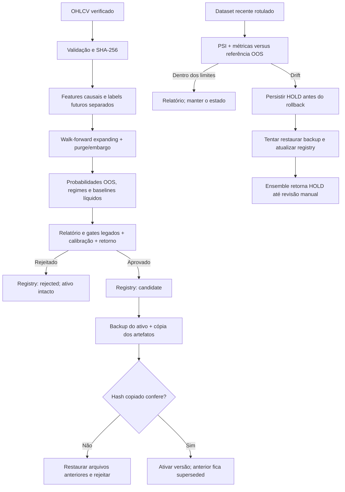

# Treino e validação de modelos — ZIA-TRADER v17

## Estado e escopo

O pipeline canônico está em `learning/training_pipeline.py`. A entrada histórica `ai/train_ensemble.py` mantém sua API/CLI, mas delega ao pipeline canônico para não gravar artefatos sem avaliação walk-forward e registry. O avaliador `learning/model_validation.py` não promove modelos; a decisão continua centralizada em `train_oos`.

A Fase 3 foi implementada e testada localmente, mas **nenhum treino real foi executado nesta sessão**: o checkout não contém CSV/Parquet OHLCV verificado, e o banco local encontrado não foi tratado como dataset de treino por falta de procedência explícita. Fixtures determinísticas aparecem somente nos testes de invariantes; não são fonte de métricas de mercado nem de aprovação.

## Contrato do dataset

Forneça CSV ou Parquet OHLCV com `open`, `high`, `low`, `close`, `volume` e timestamp temporal (`timestamp`, `open_time` ou índice DatetimeIndex). O treino exige candles fechados, valores numéricos finitos e preços positivos. Antes de usar dados externos, confirme origem, símbolo, timeframe, timezone, ajustes corporativos e política de gaps. A hash SHA-256 do arquivo acompanha o resultado e o registro do modelo.

## Execução controlada

Exemplo com custos meramente ilustrativos — ajuste para ativo, venue e período antes de avaliar dados reais:

```bash
python -m learning.training_pipeline /caminho/ohlcv_verificado.csv \
  --model-dir models \
  --horizon 3 \
  --seed 42 \
  --walk-forward-folds 3 \
  --purge-gap 3 \
  --embargo 3 \
  --transaction-cost-bps 10 \
  --slippage-bps 5 \
  --report-path docs/reports/model-validation-latest.md
```

A entrada compatível também funciona:

```bash
python -m ai.train_ensemble /caminho/ohlcv_verificado.csv --seed 42
```

Ela usa os custos padrão acima e os mesmos gates do pipeline controlado. Para personalizar todos os critérios, use `learning.training_pipeline`.

O processo:

1. Gera features causais e rótulos com retornos futuros usados **somente como labels**; não entram nas features.
2. Treina Random Forest e XGBoost com seed explícita e `n_jobs=1`; configurações e hash são armazenados.
3. Avalia janelas cronológicas expanding com treino sempre anterior ao teste, purge de pelo menos o horizonte e embargo configurável. Os retornos são medidos em blocos não sobrepostos de `horizon` candles.
4. Compara o modelo com buy-and-hold long-only e momentum determinístico de 20 barras, cobrando custos e slippage no turnover.
5. Calcula métricas de classificação por fold/regime, Brier multiclasses, ECE top-label e pontos da reliability curve.
6. Gera um relatório Markdown em `docs/reports/` antes de qualquer promoção.
7. Registra o candidato em `model_registry` e suas métricas em `model_metrics`. Só copia/ativa artefatos depois de todos os gates.

### Fluxo de treino e runtime



## Gates de promoção

Os critérios existentes permanecem; não foram reduzidos: F1 de validação mínimo, proxy OOS de Sharpe acima do limite, Brier abaixo do teto e melhoria sobre o F1 do modelo anterior quando houver baseline anterior. Foram adicionadas exigências mais estritas:

- Brier multiclasses e ECE dentro dos limites em validation, teste final e walk-forward;
- retorno líquido agregado do modelo superior **a ambos** os baselines, depois de custos e slippage;
- registro do candidato no banco antes de copiar/ativar artefatos;
- verificação de igualdade do hash entre os artefatos registrados e os arquivos copiados.

O proxy Sharpe legado ainda usa anualização fixa `sqrt(252)` e não conhece o timeframe; ele foi mantido como gate existente, mas não deve ser interpretado como Sharpe anualizado confiável. A comparação walk-forward reporta soma aritmética de retornos líquidos com notional fixo, não substitui backtest de execução.

## Calibração e comparadores

`EnsembleModel.predict_proba()` expõe as probabilidades médias alinhadas a `sell=0`, `hold=1`, `buy=2`; o método `predict()` mantém o mapeamento de ações existente. Brier multiclasses e ECE são **medidos**, não há transformação de calibração ajustada nem promessa de probabilidade calibrada.

O baseline momentum usa somente retorno passado de 20 barras e os thresholds do treino. A posição `sell` é avaliada como retorno short simétrico apenas para comparação; custos de borrow, funding, margem e restrições do instrumento não são modelados. Não use estes resultados como validação de execução ou promessa de retorno.

## Registry, promoção e rollback

`ModelRegistry` e `ModelMetric` existentes são usados sem alteração de schema. Os estados registrados são `candidate`, `active`, `superseded`, `rejected` e `drift_hold`. O artefato anterior é copiado para uma pasta `rollback_*`, seu hash é guardado e conferido antes da restauração; promoções concorrentes são serializadas por advisory lock no PostgreSQL. `register` não pode criar uma versão `active` diretamente. A entrada legada não pode mais gravar diretamente no diretório ativo.

## Monitor de drift

Com um dataset OHLCV **recente, rotulado e verificado**, o monitor compara PSI por feature com o perfil de treino e compara balanced accuracy/Brier recentes com o walk-forward registrado:

```bash
python -m learning.model_drift /caminho/ohlcv_recente_verificado.csv \
  --model-dir models \
  --window-rows 256
```

Ao cruzar um limite, grava `models/drift_status.json` com hold, emite alerta no log/saída estruturada, confere o hash antes de tentar restaurar o backup e marca as versões no registry. `EnsembleModel.predict()` então retorna `hold` até revisão. O hold é persistente e **não é removido automaticamente** quando as métricas voltam à faixa; uma pessoa responsável deve investigar e só então limpar o estado. Sem dataset recente, o monitor não pode medir drift de performance.

O monitor é um comando invocável, não um agendamento ativo nesta entrega. Uma rotina operacional pode chamá-lo depois de obter novos labels; o repositório ainda não fornece uma fonte online de labels validada para ligar este monitor continuamente.

## Transformer e compatibilidade

A camada Transformer agora usa `batch_first=True` internamente para evitar o aviso/caminho menos eficiente, mas mantém o contrato público `(seq_len, batch, input_dim)` consumido pelo engine. Um teste compara saída e shape com a implementação anterior usando os mesmos pesos. Nenhum cálculo de sinal, indicador, sizing, risco ou execução foi alterado.
