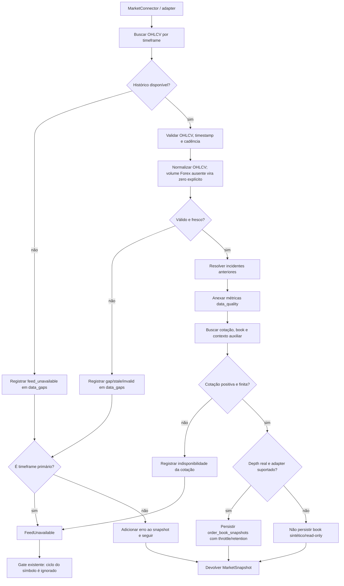

# Pipeline de qualidade dos feeds — Fase 2

Este documento descreve o caminho comum de histórico usado por Binance/CCXT, B3 read-only e Forex. A camada coleta/valida dados e registra saúde; **não produz sinais nem envia ordens**.

## Contrato de qualidade

- **Crypto:** cadência contínua 24/7; gaps na janela histórica são rejeitados.
- **B3 e Forex:** o verificador não presume candles em fechamento/fim de semana. Gaps são inferidos quando os timestamps delimitadores pertencem à mesma sessão/dia; não foi adicionado calendário oficial de feriados ou DST.
- Se o volume Forex não vier do provedor, barras ausentes são codificadas como `0.0` sem estimativa e a contagem aparece em `data_quality.volume_missing_rows_filled_zero`; valores não numéricos fornecidos pelo provedor continuam inválidos.
- O staleness máximo padrão é três intervalos (`FEED_STALENESS_MULTIPLIER=3.0`). Dados inválidos no timeframe primário não chegam ao pipeline de análise, pois `MultiTimeframeFeed` lança `FeedUnavailable`, tratado pelo engine existente como skip de ciclo.
- Para timeframe secundário, falha ou gap fica em `MarketSnapshot.errors`; o relatório de cada série válida fica em `MarketSnapshot.data_quality`.
- Histórico de livro é salvo só para CCXT ou Binance `testnet`/`demo` com bids e asks não vazios. O padrão é no máximo um snapshot por símbolo por minuto e retenção de sete dias; books sintéticos e dados sem depth não entram na tabela.

## Operação e verificação

A revisão Alembic `b7d2d043ee8a` cria `order_book_snapshots`. O banco já possui a tabela `data_gaps` criada na migração da Fase 1. Faça backup antes de aplicar em produção e confira a revisão com `alembic upgrade head` e `alembic check`. A suíte cobre candle ausente, stale, duplicado, fora de ordem, pausa de sessão, persistência/deduplicação, retenção e o gate antes da cotação.
