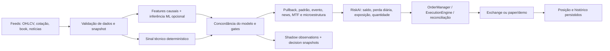

# Revisão do modelo de negociação — ZIA-TRADER v17

**Data:** 2026-10-08
**Escopo:** leitura do código e configurações versionadas após a Fase 5; orientação para Pre-production / Shadow / Demo.
**Limite:** nenhum código de sinais, indicadores, sizing, risco ou execução foi alterado; não houve conexão com exchange, VPS ou envio de ordem. As conclusões descrevem o checkout revisado, não uma medição de rentabilidade.

## Resumo executivo

O ZIA não é, no estado atual, um único “agente de IA treinado” que decide e executa de ponta a ponta. É uma **arquitetura híbrida**: regras técnicas determinísticas e gates de segurança compõem o sinal; modelos supervisionados opcionais votam na direção; dois motores diferentes (principal e Sniper) podem chegar à camada comum de execução. A camada de aprendizado associa observações shadow a retornos futuros para treino posterior — não se retreina nem se auto-promove em cada ciclo.

No checkout revisado, o diretório `models/` não contém artefatos e o default `NEURAL_MODELS_ENABLED=false`. Sem artefato Ensemble treinado nem pesos neurais, o motor principal monta `final_action="hold"`; o sinal técnico só funciona como gate de concordância, não como substituto da predição de modelo. Assim, **o código atual não demonstra uma estratégia de produção ativa nem performance validada**. O perfil versionado/Compose é deliberadamente conservador: autonomia e live desligados, shadow ligado, e o adapter mainnet requer dupla ativação explícita.

A base de infraestrutura melhorou substancialmente nas Fases 1–5, porém foram encontrados gaps relevantes de proteção na inicialização do worker e no caminho Sniper, além de parâmetros de risco declarados que não são consumidos. Por isso, o parecer é **adequado para continuação em Shadow controlado; Demo/Testnet somente após corrigir e testar os gates listados; não pronto para produção live**.

## 1. Como o modelo negocia hoje

### Fluxo de decisão

| Etapa | Comportamento efetivo |
| --- | --- |
| Dados | `MultiTimeframeFeed` exige histórico primário e cotação válida; valida OHLCV, timestamp, staleness e gaps. Book, notícias e tendências podem degradar, deixando erro explícito no snapshot. |
| Features ML | Dez features OHLCV causais: retornos, range/body, volume z-score, gaps de EMA, RSI normalizado, MACD normalizado e ATR%. O contrato e cache vivem em [`core/feature_pipeline.py`](../../core/feature_pipeline.py) e [`ai/feature_pipeline.py`](../../ai/feature_pipeline.py). |
| Modelos | Ensemble é Random Forest + XGBoost, classes `sell/hold/buy`, com rótulo default sobre retorno futuro de 3 candles e thresholds de ±0,1%. Transformer/LSTM são opcionais e inferem variação de preço; pesos precisam existir e `NEURAL_MODELS_ENABLED` precisa estar ligado. A pipeline walk-forward controlada treina apenas o Ensemble — não treina essas redes neurais. |
| Voto | O motor principal atribui pesos fixos 0,30 Transformer, 0,30 LSTM, 0,40 Ensemble entre modelos que estejam prontos. Se nenhum estiver pronto, retorna `hold`. A configuração `ENSEMBLE_WEIGHTS` do settings não é a fonte usada neste voto. |
| Sinal técnico | EMA 12/26, momentum de 5 barras, RSI 14, MACD, volume, notícias, tendência externa e fluxo do book entram no score. A direção candidata exige score ≥ +0,15 ou ≤ −0,15; confidence é `0,50 + 0,50 × abs(score)`. Sinal final também exige confidence mínima (default 0,70), volatilidade ≤ 0,08, ausência de contradição e, quando configurado, confirmação do fluxo. |
| Pullback | Ligado por default; exige tendência relativa à EMA200, linha baseada em pivôs confirmados, toque, exaustão por RSI/volume e rompimento/volume para confirmar o gatilho. Seus stops/target são calculados por ATR no próprio sinal, mas a validação de entrada do RiskAI usa os percentuais globais `STOP_LOSS_PCT`/`TAKE_PROFIT_PCT`; comparar as duas configurações ao interpretar uma decisão. |
| Gates de entrada | Direção do modelo deve coincidir com `MarketSignal`; pullback e memória de padrão podem bloquear, assim como evento econômico, news gate, pre-market, MTF opcional e custo/microestrutura. MTF está desligado por default. |
| Shadow e aprendizagem | Com shadow ativo, persiste observações e snapshots; `SignalLearningLayer` rotula depois o retorno futuro configurado e declara `orders_sent=0`. Treino é etapa offline separada e promoção depende dos gates OOS/registry. |

**Distinção importante:** o Sniper não é apenas uma versão mais rápida do mesmo voto. Ele reage a variação de preço sobre o limiar configurado, exige detecção/direção de atividade de baleia e confirma o sinal de mercado/pullback/news/circuit breaker/custo. Por default, o limiar é 2% e `SNIPER_ENABLED=false`; o worker dedicado respeita essa flag. A API, porém, não aplica a mesma checagem ao endpoint/start automático. Além disso, `AUTO_START_ENGINES=false` controla o auto-start do processo FastAPI, mas não impede o worker dedicado de iniciar o motor principal: `worker.py` sempre cria a task de trading, e pode criar a do Sniper conforme `SNIPER_ENABLED`.

## 2. Arquitetura atual versus referência robusta

| Camada de referência | O que existe | Fragilidade / trabalho restante | Avaliação |
| --- | --- | --- | --- |
| Coleta de dados | Adapters de mercado, feed multi-timeframe, cache, validação OHLCV, incidentes/gaps e snapshots do book. | Não há stream WebSocket de exchange no repositório; calendários de sessão/feriados de B3/Forex são limitados. Dataset de treino com procedência não foi confirmado. | Boa base para shadow; dados ainda precisam de validação operacional por provedor. |
| Agentes / IA | RF+XGBoost, redes neurais opcionais, features versionadas, treino walk-forward, registry, drift monitor e observações explicáveis. | Não há agente LLM/orquestrador multiagente; não há pesos nem dataset real no checkout; drift é invocável, não agendado. | Implementação MLOps razoável; **modelo não comprovado/ativo neste checkout**. |
| Core / orquestração | `TradingManager`, `RoboTraderUnified`, `SniperEngine`, `BacktestEngine`; snapshots e locks por símbolo/timeframe. | Dois caminhos de start (API e worker) não compartilham todos os mesmos gates; Sniper e motor principal não têm exatamente o mesmo caminho de aprovação. | Separação de responsabilidades existe, consistência de políticas precisa ser fechada. |
| Execução | `OrderManager`, `ExecutionEngine`, intents idempotentes, consulta por client ID e reconciliação pós-restart (Fase 5). | Mainnet adapter não propaga `client_order_id`; não existe stream WebSocket do broker. O comportamento foi validado com fakes, não contra Demo/Testnet. | Adequada para próxima fase Demo/Testnet após gaps críticos; **live não aprovado**. |
| Risco | Validação de confidence/saldo, risco por trade, exposição por símbolo/total, perda diária, drawdown, stops e circuit breaker. | Limites semanal/mensal declarados não são lidos pelo runtime; Kelly adaptativo não recebe `trade_returns` nos chamadores live encontrados; kill switch exige avaliação de consistência entre processos/restart já registrada. | Existe camada determinística, mas algumas proteções declaradas não estão efetivamente conectadas. |
| Persistência | PostgreSQL/Alembic, SQLite para dev/teste, posições, intents, decisões, candles, gaps, métricas e registry; backup/restore scripts. | TimescaleDB é opcional/desligado; política automática de retenção/backup e ensaio de restore em VPS ainda precisam de evidência. | Boa fundação relacional/auditável; precisa de operação validada. |
| Observabilidade | Logs JSON, correlation ID, métricas Prometheus, health check e instrumentação OpenTelemetry; regras Prometheus existem. | Não foi identificada integração de Alertmanager/destino de notificações; health/metrics não substituem alertas de execução/posição. | Métricas presentes, processo de alerta ainda incompleto. |
| Deploy / segurança | Compose VPS com Postgres/Redis persistentes, migração, API/worker, Nginx TLS de referência, API vinculada a loopback, auth por ambiente, flags live fixados em false. | Nenhum deploy real foi exercitado; TLS/firewall preflight do exemplo está desligado até instalação; backup, restore e Demo/Testnet em VPS pendentes. | Adequado como blueprint de preprodução, não como evidência de prontidão live. |

### Persistência e dados do agente

O esquema inclui `ai_observations`, `decision_snapshots`, `order_intents`, `reconciliation_snapshots`, `runtime_position_state`, `model_registry`, `model_metrics`, `market_candles`, `data_gaps` e `order_book_snapshots`. Há índices para símbolos/tempo e chaves únicas para intents/client IDs e versões/modelos; Alembic mantém revisões versionadas. A extensão TimescaleDB é uma opção, não premissa do Compose. Os backups são ferramentas/scripts, não evidência de backup periódico executado/restaurado no VPS.

## 3. Pontos fortes e gaps priorizados

### Fortes

- Pipeline de dados e validação fail-closed para o histórico primário.
- Decisões shadow explicáveis, snapshots contextuais e trilha de modelo/dataset/hash.
- Treino temporal com walk-forward, purge/embargo, calibração e promoção condicionada.
- Fase 5 adicionou reconciliação de intents submetidas e política sem retry automático ambíguo.
- Perfil VPS mantém `LIVE_TRADING_ENABLED=false`, `LIVE_MODE=false`, autonomia desligada por default, kill switch ativo e credenciais por ambiente.
- CI cobre compilação, testes com PostgreSQL 16 e build de container.

### Críticos antes de habilitar autonomia ou Demo/Testnet

1. **Worker aceita reconciliação `attention`:** o reconciliador retorna `attention` quando existem intents não resolvidas; `worker.py` bloqueia apenas `status == "error"` (e só quando autonomia está ligada). No Compose VPS, é o `worker.py` que executa os motores; ele sempre inicia o motor principal mesmo com `AUTO_START_ENGINES=false` (flag que só controla o FastAPI). Isso enfraquece o gate pré-start da Fase 5 e pode iniciar autonomia com recuperação pendente.
2. **Sniper não usa a mesma política de ordem:** embora receba `OrderManager`, submete entrada diretamente a `ExecutionEngine.execute_order`, contornando modo `manual`/confirmação do OrderManager. Além disso, os starts expostos pela API não verificam `SNIPER_ENABLED`; o worker verifica. Exigir política única de habilitação, reconciliação e aprovação antes de habilitar autonomia.
3. **Modelo sem artefato:** o checkout não inclui pesos/metadata em `models/`; sem eles, o motor principal fica em `hold`. Um diretório de volume no VPS pode mudar isso, mas precisa de manifesto/hash, versão aprovada e health/status explícito.
4. **Limites de risco não conectados:** `WEEKLY_LOSS_LIMIT_PERCENT` e `MONTHLY_LOSS_LIMIT_PERCENT` existem em configuração/menu, mas não têm consumidor no runtime encontrado. Não tratar como limites efetivos até implementar e testar ou removê-los da interface mediante aprovação.

### Importantes para revisão do core (sem alteração nesta tarefa)

- As parcelas do score em `calculate_market_signal` somam **1,10**, e depois o score é limitado a [-1, 1]. Confirmar a intenção da escala/normalização; nenhuma fórmula foi alterada.
- `ADAPTIVE_KELLY_ENABLED=true` não basta para ativar Kelly: `RiskAI.validate_order` requer pelo menos 20 retornos em `market_context.trade_returns`, e os chamadores live examinados não fornecem esse campo.
- Backtest é replay OHLCV com fricção configurável, pullback, evento e Ensemble opcional; não é reprodução integral dos gates live de notícia, book, multi-timeframe, Sniper, broker e latência. Os testes de paridade existentes são sintéticos e candle-only.

## 4. Checklist de prontidão

| Item | Estado na revisão | Próximo passo |
| --- | --- | --- |
| `AUTONOMOUS_TRADING_ENABLED=false`, `LIVE_TRADING_ENABLED=false`, `LIVE_MODE=false` | Conforme nos defaults/Compose do repositório | Manter assim até gates e ensaios aprovados. |
| Artefato de modelo treinado com dados verificados | Não há no checkout; treino real não foi comprovado | Adquirir dataset auditável, gerar manifesto, executar OOS, validar e registrar versão. |
| Gate de reconciliação do worker em `attention` | Pendente | Bloquear startup em qualquer status diferente de `ok`; cobrir teste de worker. |
| Habilitação e rota de ordens do Sniper | Pendente | Aplicar `SNIPER_ENABLED` e uma única política de confirmação/OrderManager; testar caminho API e worker. |
| Limites semanal/mensal e Kelly | Não efetivos nos chamadores encontrados | Definir a fonte de verdade e validar em simulação, sem mudar valores sem aprovação. |
| Mainnet idempotente e stream de exchange | Não validado; limitação já registrada na Fase 5 | Manter live desligado; tratar em etapa própria após Demo/Testnet. |
| Backup, restore, retenção e alertas | Ferramentas presentes; execução operacional não comprovada | Agendar backups, testar restore, estabelecer retenção e canal de alerta. |
| VPS + PostgreSQL + Redis + broker Demo/Testnet | Não ensaiado | Preflight, falhas de restart/timeout/fill parcial, reconciliação e observação sem fundos reais. |

## 5. Nota de robustez e plano

**Nota: 6/10 para a base de preprodução; prontidão live: não aprovada.** A pontuação reconhece migrações, persistência, dados, observabilidade básica, MLOps e reconciliação recém-integrada. Não é maior porque não há evidência de modelo treinado/artefato validado, não houve teste de broker/VPS real e foram encontradas inconsistências concretas nos gates do worker/Sniper e limites de perda.

| Prioridade | Ação recomendada |
| --- | --- |
| **Alta** | Corrigir e testar gate de reconciliação no `worker.py`; alinhar flag `SNIPER_ENABLED` e caminho de execução/confirmação do Sniper entre API e worker. |
| **Alta** | Manter autonomia/live desligados; somente promover a Demo/Testnet após os gates acima e validação com fakes + ambiente de broker isolado. |
| **Alta** | Treinar/registrar um modelo com dataset verificável ou deixar explícito no health/status que não existe modelo ativo e que o motor principal ficará em HOLD. |
| **Média** | Revisar pesos do score e ligação dos limites semanal/mensal e Kelly, sem mudar a lógica protegida sem aprovação. |
| **Média** | Melhorar paridade do backtest para incluir custos/slippage reais por ativo, gates relevantes e dados sincronizados antes de usar métricas como evidência. |
| **Média** | Ensaiar backup/restore e deploy VPS; configurar alertas acionáveis, retenção de observações/candles/logs e monitoramento de drift. |

## Fontes internas revisadas

- [Motor principal](../../core/engine.py), [sinal de mercado](../../core/market_signals.py), [pullback](../../core/pullback_strategy.py), [Sniper](../../core/sniper_engine.py).
- [RiskAI](../../risk/risk_ai.py), [regras de risco](../../core/risk_guard.py), [política de saída](../../core/position_policy.py), [OrderManager](../../execution/order_manager.py), [ExecutionEngine](../../execution/execution_engine.py).
- [Training pipeline](../../learning/training_pipeline.py), [features/labels](../../ai/feature_pipeline.py), [camada de aprendizagem](../../core/learning_layer.py).
- [Worker](../../worker.py), [API/lifecycle](../../main.py), [Compose VPS](../../docker-compose.vps.yml), [Fase 5](phase5_status.md) e [findings permanentes](../FINDINGS.md).
